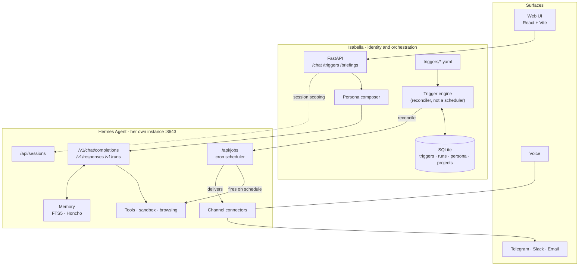

# Architecture

## The boundary

This is the most important thing in the repo. Everything else follows from it.

**Hermes Agent is the substrate. Isabella is the identity on top of it.**

Hermes already ships persistent memory, a cron scheduler, sandboxed tool execution,
model routing, and connectors for Telegram, Discord, Slack, WhatsApp, Signal, Email
and CLI. Isabella does not rebuild any of that.

| Concern | Owner | Notes |
|---|---|---|
| Personality, voice, values | **Isabella** | Versioned persona, composed per request |
| Trigger definitions - *what should happen and why* | **Isabella** | YAML in `triggers/`, source of truth |
| Briefing composition - what belongs in a morning summary | **Isabella** | Domain logic, not a prompt string |
| Web UI | **Isabella** | React, talks only to Isabella's API |
| Project registry - which repos/areas she cares about | **Isabella** | SQLite |
| Run history, audit trail | **Isabella** | SQLite |
| Action policy - who may do what | **Isabella + Hermes** | Two layers; see [PERMISSIONS.md](PERMISSIONS.md) |
| Inference / model routing | **Hermes** | OpenAI, Anthropic, OpenRouter, or local Ollama/vLLM |
| Tool calls, web browsing, vision | **Hermes** | `terminal`, `browser`, `file`, `web` toolsets |
| Sandboxed code execution | **Hermes** | local, Docker, SSH, Modal backends |
| Long-term & conversational memory | **Hermes** | FTS5 session search, Honcho user modeling |
| Scheduling - *when things fire* | **Hermes** | built-in cron, driven via the Jobs API |
| Channel delivery (Telegram, Slack, email, …) | **Hermes** | Isabella is not in these call paths |
| Voice | **Hermes** | `tts` toolset |

**The rule:** Isabella owns *what should happen and why*. Hermes owns *when it fires
and how it executes*.

### The tension, stated plainly

Autonomy is the top priority for this project, and the scheduler lives in Hermes. That
is deliberate, and it has a consequence worth internalising: **Isabella does not have a
heartbeat of her own.** Her trigger engine is a *compiler*, not a runtime. It reads
declarative trigger definitions and reconciles them into Hermes jobs; Hermes' cron then
does the waking up.

The upside is that autonomy works even when Isabella's process is down. The cost is that
Hermes is a hard dependency for anything proactive - if Hermes isn't running, nothing
fires. Accepted knowingly. If that ever becomes intolerable, the escape hatch is to add
an internal scheduler behind the same trigger interface, and the YAML doesn't change.

---

## Components



Note the direction of the trigger arrow: Isabella pushes desired state *into* Hermes.
Hermes fires and delivers on its own. Isabella can be offline when the briefing goes out.

---

## One Hermes each

**`~/.hermes` belongs to Selene.** It is a live install - gateway PID 93753 was running
when this was written, and Selene's `src/core/loop.ts`, `src/core/reason.ts` and
`server/routes.ts` all reference it directly.

Isabella cannot share it. A Hermes install is a single-tenant thing: one `SOUL.md`, one
`config.yaml`, one `state.db`, one set of `platform_toolsets`, one port. Two AIs with
different personalities and different permission ceilings cannot both own those. The
toolset ceilings proposed in [PERMISSIONS.md](PERMISSIONS.md) would silently retune
Selene.

So each gets her own instance:

| | Selene | Isabella |
|---|---|---|
| `HERMES_HOME` | `~/.hermes` | `~/.hermes-isabella` |
| API port | 8642 | 8643 |
| `SOUL.md`, `config.yaml`, toolsets | hers | hers |
| `state.db` - transcripts, memory | hers | hers |
| Gateway process, PID file, service | separate | separate |

`HERMES_HOME` is the supported mechanism - Hermes' own documentation notes it "also
scopes the gateway PID file and systemd service name," so two gateways coexist by design
rather than by luck. Verified on this machine: both gateways run simultaneously, Isabella
on 8643 (PID 66502) and Selene on 8642 (PID 93753).

**`HERMES_HOME` redirects state, not code.** The `hermes` wrapper hardcodes a single shared
program install at `~/.hermes/hermes-agent/`. One binary, two state directories - so a
Hermes upgrade lands for both instances at once, and neither can be pinned independently.

**Cost:** two Ollama-backed gateways on one machine, and model weights loaded twice
unless both point at the same Ollama server. They can - `model.base_url` is
`http://127.0.0.1:11434/v1` in both, so Ollama is shared while everything else is not.
Shared inference, separate minds.

**The rule for anyone working in this repo:** always set `HERMES_HOME` before any
`hermes` command. An unset variable edits Selene.

---

## The Hermes API surface

Verified against the [API server reference](https://hermes-agent.nousresearch.com/docs/user-guide/features/api-server).
Bearer auth (`API_SERVER_KEY`) is required on every endpoint, **including on loopback**.

| Purpose | Endpoints Isabella uses |
|---|---|
| One-shot turn | `POST /v1/chat/completions` |
| Stateful turn | `POST /v1/responses` (`previous_response_id`) |
| Long task w/ progress | `POST /v1/runs`, `GET /v1/runs/{id}/events` (SSE), `POST /v1/runs/{id}/stop` |
| **Scheduled work** | `GET` + `POST /api/jobs`, `PATCH` + `DELETE /api/jobs/{id}`, `POST /api/jobs/{id}/{pause,resume,run}` |
| Sessions | `GET` + `POST /api/sessions`, `GET /api/sessions/{id}/messages`, `POST /api/sessions/{id}/fork` |
| Capability discovery | `GET /v1/capabilities`, `GET /v1/skills`, `GET /v1/toolsets` |
| Health | `GET /health`, `GET /health/detailed` |

**Session headers.** `X-Hermes-Session-Id` scopes a transcript and rotates on `/new`.
`X-Hermes-Session-Key` is the *stable* per-surface identifier that long-term memory
(Honcho) keys off - max 256 chars, no control characters. Isabella must send a
consistent session key per surface, or memory fragments into one scope per session.

**Browser access.** The web UI must not hold the Hermes key. All browser traffic goes
to Isabella's API, which holds the key server-side. `API_SERVER_CORS_ORIGINS` stays
unset; there is no direct browser→Hermes path.

---

## Trigger model

The native automation primitive. Three parts:

```
trigger  →  condition  →  action
```

- **trigger** - `schedule` (cron), `webhook` (external systems call in), `event`
  (something Isabella observes), or `manual`.
- **condition** - optional predicate. Skip silently when false. Keeps "brief me on
  weekdays only" out of the prompt.
- **action** - `prompt` (ask Hermes, with persona applied), `tool` (direct tool call),
  or `notify` (deliver to a channel).

Definitions live in `triggers/*.yaml` and are the source of truth. The engine reconciles
them against `/api/jobs`: create what's missing, `PATCH` what drifted, `DELETE` what was
removed. Reconciliation is idempotent - running it twice changes nothing.

### Worked example - the daily briefing

```yaml
# triggers/daily-briefing.yaml - the real file, not a sketch
id: daily-briefing
enabled: true

trigger:
  type: schedule
  cron: "0 7 * * *"
  timezone: Asia/Manila     # an assertion about her Hermes instance - see below

condition:
  weekdays: [mon, tue, wed, thu, fri]

action:
  type: prompt
  skills: []                # no skills, and no toolsets either
  script: briefing_fetch.py # runs first; its stdout becomes prompt context
  prompt: |
    The script output above is your calendar and unread email. It is the only
    source you have - you have no tools and cannot look anything up.
    Brief me from it:
      1. What's on today, in order, with anything that needs prep called out.
      2. Email that actually needs me - not newsletters, not receipts.
      3. One thing you think I'm forgetting.
    Be direct. If it's a quiet day, say so in one line and stop.

deliver:
  channel: local            # telegram once the connector is configured

guardrails:
  max_runs_per_day: 1
  timeout_seconds: 180
  on_failure: notify   # tell me it broke; never silently skip
```

There is no `persona:` key. Her identity is installed once at
`~/.hermes-isabella/SOUL.md` and applies to every surface including cron; naming it
per-trigger would stack a second identity on top of it.

The schema is strict (`extra="forbid"`): an unknown key is a startup error. A trigger that
acts unprompted is the wrong place to be forgiving about spelling - `max_runs` instead of
`max_runs_per_day` must not quietly mean *no limit*.

**What the reconciler has to absorb**, all verified against Hermes 0.20.4:

| Hermes' behaviour | What the engine does |
|---|---|
| `POST /api/jobs` takes only `name`, `schedule`, `prompt`, `deliver`, `skills`, `repeat` - `model`, `enabled_toolsets` and `workdir` are dropped silently | The client filters to what lands, so a dropped field can't read as an applied one. **A job cannot carry its own toolset restriction over HTTP** - `platform_toolsets` is the only lever |
| `schedule` is sent as a string, returned as `{kind, expr, display}` | Compare against `expr`, or every reconcile PATCHes forever |
| `GET /api/jobs` **hides disabled jobs** unless `include_disabled=true` | Always ask for them. Otherwise a paused job looks missing and gets duplicated - unpaused |
| Cron fields must match `^[\d\*\-,/]+$` before croniter sees them | `condition.weekdays` compiles to `1,2,3,4,5`, never `mon-fri`. Folding it into the cron also means a skipped day never wakes the model |
| Job names are not unique | Reconcile groups by name and deletes duplicates, oldest wins |
| **One timezone per instance** - no per-job timezone | `timezone:` is checked against `HERMES_TIMEZONE` and refuses on mismatch, rather than firing hours off every day |
| `script` and `no_agent` are absent from both POST and PATCH | Reconcile refuses to create a script trigger and returns the `hermes cron create` command; drift is reported, not repaired |
| Unset `platform_toolsets` for a platform means **thirteen** default toolsets, not none | `cron: []` explicitly. The unattended path was the widest surface in the system until this was checked |

### Pre-fetched context - facts without tools

The briefing needs the calendar and the inbox. Those are not native Hermes tools; they come
from a skill that shells out, which needs `code_execution` or `terminal` - both removed by
[PERMISSIONS.md](PERMISSIONS.md) P0, with no Docker on this machine to sandbox them.

So the data is fetched **before** the model runs. `action.script` names a script under
`HERMES_HOME/scripts/`; Hermes runs it each tick and injects its stdout into the prompt as
`## Script Output`. The model composes the briefing from that and has **no tools at all**
(`platform_toolsets.cron: []`).

```
cron tick -> briefing_fetch.py -> stdout injected -> model (zero tools) -> prose -> deliver
```

The distinction that makes this safe: the script is code written and reviewed once, sitting
in a directory Hermes containment-checks. Granting the toolset instead would mean *the model
composing execution at runtime*, unattended, outside `permit()`. Same data, entirely
different blast radius.

Two consequences, neither of them optional:

- **The repo owns the script.** `scripts/` here is the source; Hermes runs the copy in
  `HERMES_HOME/scripts/`. `GET /triggers` compares them and reports `script_install.drifted`,
  because this is exactly the `SOUL.md` failure in a different directory.
- **The script must fail loudly.** A model with no tools and an empty context invents a
  plausible day. Every failure prints an explicit `UNAVAILABLE` line, and the prompt is
  told an invented meeting is worse than an admitted blind spot.
- **The job cannot be created over HTTP.** `POST /api/jobs` takes neither `script` nor
  `no_agent`. Reconcile refuses and returns the `hermes cron create` command to run once;
  after that it manages schedule, prompt, delivery and the kill switch as normal. Script
  drift is reported, never repaired - PATCH cannot fix it either.

`enabled: false` deletes the job; `POST /triggers/{id}/pause` stops it at Hermes and
**outranks the file** until someone resumes it - a kill switch that lasted only until the
next reconcile would not be one. Other edits still reach a paused job: pause freezes
*whether* it runs, not *what* it would do.

### Guardrails are not optional

Anything that can act unprompted must carry a rate limit, a timeout, and a kill switch.
`enabled: false` disables at the source; `POST /api/jobs/{id}/pause` stops it at Hermes.
A trigger whose action creates a condition that fires itself is the failure mode to
design against - that's why `max_runs_per_day` is mandatory, not a default.

---

## Persona system

Her identity is defined in [`Personality/`](Personality/) - fourteen markdown files - and
[BIOGRAPHY.md](BIOGRAPHY.md), her life. [ORIGIN.md](ORIGIN.md) bounds what she may honestly
claim to know about Owen.
Both are read by the persona composer; neither is hardcoded into a prompt string.

Personality is not a static string baked into Hermes. It's composed per request:

```
system prompt  =  core identity          (Personality/ - traits, dials, theme)
               +  life                    (BIOGRAPHY.md - where the traits come from)
               +  honest-knowledge bound (ORIGIN.md - what she may claim about Owen)
               +  situational context    (time, place, what she's mid-way through)
               +  surface adaptation     (terse on Telegram, fuller in the web UI)
```

Kept on Isabella's side for three reasons: it can be versioned and rolled back
independently of Hermes; it can vary per surface and per trigger without touching
Hermes config; and swapping the substrate later doesn't take her identity with it.

Recalled facts come from Hermes' memory via the session key - Isabella does not
assemble a memory context of her own. See below.

---

## Data and state

SQLite at `data/isabella.db`. Isabella stores only what *she* owns:

| Table | Holds |
|---|---|
| `triggers` | Parsed definitions + the Hermes `job_id` they reconcile to |
| `runs` | Execution history: when, outcome, why it failed. Hermes' cron fires without Isabella in the path, so she **pulls** its execution records in rather than being told - keyed on Hermes' execution id, which is what makes the sync idempotent. Her row is an index into Hermes' ledger, never a second copy of it |
| `persona_versions` | Versioned identity, with the ability to roll back |
| `projects` | The repos and areas of life she tracks |
| `decisions` | Every permission verdict - allow, ask and deny alike |

**What is deliberately absent: conversation history and long-term memory.** Those live
in Hermes - in `~/.hermes-isabella/state.db`, her own instance. Measured on Selene's
equivalent install for scale: 62 sessions and 249 messages reach 6.1 MB in three days.
Full inventory, schema and egress analysis in [DATA.md](DATA.md).

The failure mode this avoids: two memory systems drift, and then there is no answer to
"what does she actually know about me?" Every recall path resolves in one place. If
Isabella needs to remember something, it goes to Hermes through the session key - never
into a second store here.

---

### Decided 2026-08-26 - reading Hermes' state back, so the interface can show what she holds

**The decision:** Isabella may **read** `~/.hermes-isabella/state.db` and
`~/.hermes-isabella/memories/*.md` directly, read-only, through exactly one module -
`core/hermes/state.py`. She may not write to either, ever.

**Why it was needed.** Three screens had no source otherwise:

- the **chat log**, which is the transcript. Isabella stores no message content by design
  (above), so the only copy is Hermes'. Without this the interface could show the current
  browser session and nothing before it.
- the **brain on `home`**, which draws what she holds as a graph.

(A third reader was built on the same day and removed: a `log` view over `logs/*.log`. See
below - logs are terminals.)

**Why it is not a second store.** Nothing is copied here. Every one of these reads happens
at request time and is discarded with the response - the same shape as reading a delivered
briefing back off disk, decided above. The prime directive forbids Isabella *owning* memory
or transcripts; it does not forbid her *showing* Hermes'. The line is writing, and the
connection is opened `mode=ro` so a stray write is an error from SQLite rather than a
corrupted agent.

**The cost, stated.** This is the second module coupled to Hermes' internals, and the
tighter of the two: `client.py` couples to an HTTP API, this couples to a **schema**.
Upstream can move it. Every column is named explicitly rather than `SELECT *`, so a
removed column fails on one query with a legible message instead of silently shifting a
tuple index, and `tests/test_mind.py` carries a cut-down copy of the schema so the break
lands in a test rather than in the view.

---

### Decided 2026-08-26 - what the brain on `home` is made of, since there is no memory graph

Selene's home screen is a HUD with a brain at its centre and the brain is her memories.
Isabella has no memory table and must not have one, and Hermes' gateway exposes no memory
endpoint - so a faithful port had nothing to draw.

**What it draws instead**, all of it real and all of it on disk in `HERMES_HOME`:

| kind | what it is | where it comes from |
|---|---|---|
| `memory` | a curated entry she has kept | `memories/MEMORY.md`, `USER.md` |
| `session` | one conversation | `state.db` sessions |
| `message` | one thing said in it | `state.db` messages |

The geometry is Selene's, unchanged: memories take the stem and the deep structures (the
frame everything hangs off), sessions spread over the cortex, and a message sits beside the
session it belongs to. Only the names changed - `core`/`entity`/`atomic` became
`memory`/`session`/`message`.

**Three rules the graph is held to:**

1. **Nothing is invented.** A memory's importance is 0-10 *where the entry records one* and
   `null` where it does not. Hermes' memory format has no importance field, so this is an
   `[importance: N]` tag Isabella **reads and never writes**; an entry without one is
   unrated, is drawn hollow, and says "unrated" rather than "0/10". A default of 5 would be
   Isabella asserting a judgement about Owen's life that nobody made - the same rule
   `core/body.py` follows for an unlogged weight.
2. **Every radius is a real count** - importance for a memory, message count for a session,
   tokens for a message, normalised server-side into `size`.
3. **Violet is what is LIVE, and only that.** The lit nodes are the session being spoken in
   and the messages in it, which genuinely are the context of her next turn. The three kinds
   are told apart by **value** - silver, grey, faint - not by hue, because a second colour
   here would say "this is happening" about a conversation from Tuesday.

**Known thinness:** `memory.memory_enabled` is `false` on her instance today, so the memory
tier is empty and the graph is sessions and messages only. The view says so in words rather
than letting an absent third of the volume pass unremarked. Turning it on is a Hermes config
change with its own blast radius - it adds the `memory` toolset to whichever platforms are
not explicitly `[]` - and is not made here.

---

### Decided 2026-08-26 - reading a delivered briefing back off Hermes' disk

`deliver: local` writes each cron run to
`~/.hermes-isabella/cron/output/<job_id>/<local timestamp>.md`. That file is the **only**
place the text of a delivered briefing exists on this machine outside her transcripts: the
jobs API carries an execution's status and nothing of its output - `latest_execution` is
`{status, timestamps, error}` - and the dashboard's `/api/cron/jobs/{id}/runs` is not
mounted on the API-server surface.

So the web UI had three options, and two of them were wrong:

| Option | Verdict |
|---|---|
| Store the text in `runs` when Isabella sees it | **No.** That is a second message store, which the section above exists to forbid |
| Ask upstream for an output endpoint, wait | Right long-term, blocking now |
| Read Hermes' output directory at request time, keep nothing | **Chosen** |

It is the first coupling to Hermes that is a *filesystem* one rather than HTTP, so it lives
in `core/hermes/outbox.py` for the same reason the client does: when upstream moves, one
module changes. The rule in `CLAUDE.md` is unchanged in spirit - **`core/hermes/` is the
only module that touches Hermes**, by any means.

Two properties this keeps: nothing is cached, so Isabella's database still holds no message
content; and a run with no file is reported as *having no briefing* rather than as an error,
because a failed run that never got as far as speaking is a normal thing to look at.

A run record and an output file are joined **on time** - the file is named for the second
the job finished, and neither side carries the other's id. The tolerance is 120s. If a
trigger is ever allowed to run more often than that, this join needs an id instead.

---

### Decided 2026-08-26 - every view has an address

The interface lived entirely at `/`. Views were state, so a reload put you back on home no
matter what you were reading, nothing could be linked or bookmarked, and the back button did
nothing.

**The routes:**

| path | what |
|---|---|
| `/` | home - the brain, and her latest reply |
| `/chat` | the transcript |
| `/briefings` | the run ledger |
| `/triggers` | what fires, when, and whether it is paused |
| `/body` | Owen's body log |
| `/health` | hers - model, gateway, persona, storage |
| `/settings` | an index of what can be configured |
| `/settings/google` | the Google grant |

`google` moved under `settings` because that is what it is. `body` and `health` stayed at the
top level because they are *readings*, not settings - the distinction is worth keeping in the
address bar rather than lumping everything configurable-looking together.

**`ROUTES` in `App.tsx` is the single table.** The palette builds its view commands from it,
the number keys index into it, and the renderer switches on it. A path can only exist in one
place, so adding a view is one line and there is nothing for two lists to disagree about.

**No router dependency.** `web/src/router.ts` is about forty lines: read `location.pathname`,
`pushState` without a reload, listen for `popstate`. Eight static paths, no params, no
loaders, no nesting past one level - `react-router` would be a dependency bought for nothing,
which is the check CLAUDE.md's dependency rule asks for.

**An unknown address says so** and names the ones that exist. Redirecting to home would be
tidier and would hide the typo that got you there - the same reasoning as everywhere else in
this project that an absence is drawn rather than filled.

**Home is never replaced.** Picking a view from home opens it in a **window** of its own.
Home is the screen that stays up - the brain, her latest reply - and navigating over the top
of it to read the trigger list was the wrong trade.

A window rather than a tab, because a tab is only unhidden while it is the front tab: put
`chat` in a tab and home is behind a tab strip, which is the same complaint in a smaller
form. Mechanically this is `window.open(url, name, features)` - passing any features is what
makes the browser spend a window instead of a tab, which is why `chrome()` must never return
an empty string. The new window is offset from the current one rather than centred: a window
landing exactly on top of home reads as home having been replaced.

**The feature string is a request, not an instruction**, and that is not a detail. When home
is maximised or full-screen the browser hands the new window the same shape - so it opens
covering home completely, which is precisely what spending a window on it was supposed to
avoid. The size is therefore applied twice: once from the opener, and once by the new window
itself on first load, which is the reliable half because it runs in that window's own context
after it exists. The self-correction fires only when the window came out covering the screen,
and only once per window, so a window someone maximised deliberately is never shrunk back.

macOS native full-screen is the case that cannot be fixed: the browser opens the new window
in its own Space and no script can pull it back. It is still resized, so it is an ordinary
window once you leave that Space.

The window is named, so picking `chat` twice reuses the chat window instead of opening a
second; from a spawned window everything navigates in place, because it is already not home;
and from a spawned window `home` - or `Q` - *closes* it, because a second copy of home in a
window called "chat" is worse than no window at all. `Q` exists because every other way out
of a view is a keystroke, and a window that has to be closed with the mouse would be the one
place this interface makes you reach for the trackpad. A deep link typed by hand has no opener and
behaves like an ordinary page.

This is the part no router ships, and it is the reason `router.ts` is hand-written rather
than `react-router` with a rule bolted on beside it.

**The constraint it introduces:** a window is a separate copy of the app, with its own chat
state and its own session id. So anything that has to stay with this window's memory
navigates *in place* - asking her something from `/triggers` moves to `/chat` in the same
window rather than spending a window the answer would not be in. And `open()` has to stay
synchronous from the keypress that called it, or the browser treats it as an unsolicited
popup and blocks it.

**What did not change:** there are still no links. `/settings` lists Google as a readout with
the command that opens it, not as something to click. The palette is still how you go
somewhere; the addresses are so you can come *back* to somewhere.

---

### Decided 2026-08-26 - one input, and it is the palette

Home shipped with a chat box under the core. It came off the same day.

**Why.** The interface then had two inputs on one screen - the palette (`K`) and the box -
and nothing about either announced which was which. A new pair of eyes had to work out the
difference before typing anything, and the honest answer is that there is no difference
worth learning: both take a string and do something with it.

**What it is now.** `K` is the only input. The palette matches the string against the live
command list; if nothing matches, the string is a sentence and is said to her. Commands win
the tie - typing `body` shows the body rather than asking her about bodies - and the ask row
appears only when the match set is empty, so it never competes with a command.

**Why this is the right shape rather than a tidy one.** It is the M6 shape. A command router
does not care whether the string arrived from a keyboard or a microphone, and "say the thing
you want" is already how voice will work - there is no second microphone for commands. The
palette was always going to be that router; this makes it the router for everything now
rather than at M6.

**The one thing that had to be visible.** The ask row is drawn in sans, in a list that is
otherwise mono. That is the design system's split - two faces, by who is speaking - and it
is doing the work the second box was doing badly: saying *this one is a sentence, the rest
are things the machine will do*. It also carries the violet, because pressing Enter on it
starts her thinking, which is exactly what the colour is reserved for.

---

### Decided 2026-08-26 - logs are terminals, and there is no log view

**Built, then removed on the same day.** A `log` view read `HERMES_HOME/logs/*.log` through
`core/hermes/logs.py` and `GET /log`, with the level as a floor and the counts beside it. It
worked. It was still wrong.

**Why it went.** Her logs were already readable - `open logs`, `open errors`, `open gateway`
open Terminal.app on them, live. A second reader in the browser meant two places to look at
one file, with the browser one strictly worse at the thing a log is for: `tail -f` is a
terminal idiom, and a scrolling log wants a terminal.

**What replaced it:** colour, in the terminal. `core/logcolour.awk` is piped onto the three
log targets. Red is an error, yellow a warning, everything else dim; a traceback's own lines
carry no level and inherit the colour of the line above, so a stack trace reads as part of
the error it belongs to. Three steps and no more - the question being asked of a scrolling
log is *is anything wrong*, and a rainbow answers it worse than three colours do.

**Closing them, added 2026-08-26.** `close logs`, and `close terminals` for all of them.
Two things make it safe to have at all: every tab she opens is stamped `Isabella · <target>`
as its custom title, and that title is the only thing the close path matches on - Owen's own
Terminal windows are never candidates. And the kill is bounded to the commands this module
itself runs (`tail`, `awk`, `cat`, `head`, `ls`), never the shell, so a process he started in
a window of hers is not hers to end. That kill is the single non-read-only thing in
`desktop.py` and is called out in its own docstring.

**Terminal refuses to close a busy window, silently.** `close window id N` returns success
and the window stays while a job is running in it - there is no error, because what Terminal
wants to do is show its "terminate running processes?" sheet and it cannot show that to a
script. So closing is three steps in order: kill what is running, wait for `busy` to go
false, then close. If something is still running after the kill it is something Owen started
in a window of hers, and that window is reported and left alone rather than fought over.

This was got wrong first. The original implementation concluded that `close` did not work at
all and hid windows instead. The mistake was the measurement: `id of every window` keeps
returning ids for windows that have already closed, so a successful close looked like a
no-op. `_LIST` enumerates windows that still have tabs, which is the reading that matches
what is on screen. See HISTORY.

The window is closed for real, so `open logs` opens a fresh one; when a window for that
target is already up it is brought to the front and its command restarted if it had stopped.

**The constraint it had to keep.** **The constraint it had to keep.** `core/desktop.py` executes on the host, and its whole
security argument is that the commands are constants. The awk program is a git-versioned
file next to `desktop.py` and its path is derived from the module's own location - not from
a request, a prompt, or a model's output. It lives in a file rather than inline because the
command ends up inside an AppleScript string, and an awk program full of quotes and
backslashes through that escaping is a bug waiting to happen.
`tests/test_desktop.py` asserts every stage of every pipeline is one of `tail`, `cat`,
`awk`, `head` - a pipeline is only as read-only as its last stage.

**And `chat log` became `chat`.** It is the transcript, not a log; naming it "chat log" put
it in the same sentence as the agent log, which is the confusion this whole decision is
about. It stays a view because it is prose she wrote, not machine output.

---

## Decided 2026-08-26 - opening a terminal on the host

**This is the only path in Isabella that executes anything**, so it is written down
before it is used rather than after.

`POST /desktop/open/{name}` opens Terminal.app on one of four named targets - her agent
log, her error log, her gateway log, or the most recent briefing as Hermes wrote it. Owen
asked for it in the plainest possible terms: *"open logs, which should start a terminal
that listens to our session logs."*

**Why this does not reopen the floor.** [[PERMISSIONS]] P0 removes `terminal` and
`code_execution` from every Hermes platform - *capability removed, not sandboxed* - and
Docker is not installed, so `TERMINAL_ENV=docker` is not an available fallback. None of
that changes:

| | |
|---|---|
| **The commands are constants** | A caller sends a *name*. `core/desktop.py` looks it up in a table and runs the command written there. Nothing composes a command from a request, a prompt, or a model's output; an unknown name is a 404, never a passthrough |
| **Every target is read-only** | `tail` and `cat`. A test asserts this over the whole table, so adding a target that writes fails the suite |
| **It never touches Hermes** | This is Isabella's own process. Her Hermes instance still has no terminal and no code execution, and the 07:00 path still has `platform_toolsets.cron: []` |
| **The model cannot call it** | It is an endpoint Owen drives from the palette. Selene's own `tools.ts` draws the same line: *"wiring a write to a regex with no confirmation step would be the Awareness-and-Sensing argument made backwards"* |

**What it costs, stated honestly.** It is still execution on the host, and the gate today
is that the command is a constant rather than that a policy allowed it. When `permit()`
lands ([[PERMISSIONS]] P1) this becomes a `Desktop(open:*)` decision with a real subject.
It is also **macOS-only** - AppleScript into Terminal.app - which [[ROADMAP]] M5 has to
account for the same way it accounts for the iMessage bridge. It degrades to an explicit
"not available on this host" rather than an exception.

**What would change the answer.** A target whose command is built from a parameter, a
target that writes, or anything that lets Hermes reach this endpoint. Any of those is a
different decision and needs its own entry here.

---

## Portability

Isabella must run wherever it's convenient: this MacBook now; a Mac Mini, the old
Windows PC, a Raspberry Pi, or a VPS later. Docker Compose is the deployment unit -
Isabella's API, the web UI, and Hermes as services on one network.

Constraints that follow: no macOS-only assumptions in core code; ARM64 must build
(Pi, Apple silicon); all config through environment variables, never hardcoded paths.

Capabilities degrade by host, and that's expected:

| Host | Loses |
|---|---|
| Non-macOS | iMessage bridge |
| Raspberry Pi | Local inference - must use a hosted provider through Hermes |
| VPS | Access to anything on the home network |

---

## Open decision - how Google authorisation actually happens

The briefing needs a Google token. Getting one is **not** a missing file; it is a flow
nobody has designed yet:

```
Owen picks which Google account and which scopes (Calendar? Gmail? both?)
  -> Google's consent screen, in a browser
  -> redirect back with a code
  -> exchange for a refresh token
  -> store it where briefing_fetch.py can read it
```

The skill ships `scripts/setup.py`, which drives this from a terminal and is enough for one
person once. That is the cheap path and it is probably the right one for M2 - **audience of
one**, and a consent screen he clicks through himself is not worth a redirect handler.

What makes it a real decision rather than a chore:

- **A refresh token is a standing grant.** It reaches the calendar and the mailbox until it
  is revoked, and it will sit on disk next to a process that acts unprompted at 07:00. That
  belongs in [PERMISSIONS.md](PERMISSIONS.md)'s blast-radius thinking, not in a setup step.
- **Scopes are the actual permission boundary.** Read-only Calendar and read-only Gmail are
  a different thing from the send and delete scopes the skill can request. Isabella's policy
  may only ever be *narrower* - so the scopes granted here become her real ceiling for
  Google, above anything `permit()` says.
- **M3 changes the calculus.** Once the web UI exists there is somewhere to put a proper
  "Connect Google" button and a redirect endpoint. Building that now would be M3 work done
  early, which is exactly what the sequencing rule forbids.

**Resolved 2026-08-26 - the flow lives in the web UI.** Decided in the order this section
asked for: scopes first, then the flow.

**Scopes: `gmail.readonly` and `calendar.readonly`, and nothing else.** She can read the day
and the unread mail; she cannot send, delete, or modify. This build of the skill pins exactly
those two and offers no flag to widen them, so the ceiling is enforced by the thing that
requests it rather than by a note in a document.

**The flow: Isabella drives Hermes' own `setup.py`, from a panel in `web/`.** Get the consent
link, approve it in a browser under Owen's own Google login, paste the redirected URL back
once. `core/hermes/google_auth.py` runs the script as a subprocess with `HERMES_HOME` set
explicitly to hers - the default is Selene's, and a grant written there would be useless to
Isabella and sitting in another agent's directory.

Two things this deliberately did **not** do:

- **No OAuth implementation of her own.** The skill already owns PKCE, the pending session,
  the exchange, refresh and revocation. Duplicating credential handling is the worst possible
  application of the prime directive's exception.
- **No token in the browser.** This is the correction worth keeping: Firebase and Supabase put
  the session in a cookie, and a cookie is unreachable at 07:00, when the briefing fires with
  no browser open and nobody logged in. The grant is a refresh token on disk in her
  `HERMES_HOME`, which is the only form of it she can use unattended.

**What is still true from the paragraphs above:** a refresh token is a standing grant sitting
next to a process that acts unprompted. So revocation is a first-class control in the same
panel - one button, not a remembered terminal command.

## Open decision - remote access

**UNDECIDED.** Deliberately not settled at charter stage. Documented so the tradeoff
doesn't get re-litigated from scratch, and so nothing gets built that forecloses a path.

| Option | For | Against |
|---|---|---|
| **Tailscale** *(recommended)* | Private mesh across all devices; zero ports exposed; works identically on Mac/Windows/Pi/VPS; no TLS or auth to build | Every client device needs Tailscale installed |
| Public HTTPS + token auth | Reachable from anything with a browser | Real attack surface on a service holding calendar, email, and shell access; needs a domain, certs, and hardening |
| Messaging as transport | No inbound network at all; Hermes already polls Telegram | No web UI from outside; constrained to what fits in a chat message |

**Recommendation: Tailscale**, with messaging as the fallback surface - that combination
covers every device without exposing anything. Decide before M5.

Until then: bind to `127.0.0.1`, and treat "how do I reach her from my phone" as
answered by Telegram.

---

## Risks

**Hermes upstream churn.** Isabella depends on an actively-developed project's HTTP API.
*Mitigation:* all Hermes calls go through one typed client in `core/hermes/`. When
upstream changes, exactly one module changes. Pin the Hermes version and upgrade
deliberately.

**Memory duplication.** The most likely way this project rots - a cache here, an
embedding store there, and suddenly her knowledge has two sources. *Mitigation:* the
prime directive in `CLAUDE.md`, and the absence of any memory table in the schema above.

**Runaway autonomy.** A trigger that loops, spams, or acts on stale context. Real risk
once she has tool access to email and a shell. *Mitigation:* mandatory guardrails per
trigger; every run written to `runs` before delivery; `on_failure: notify` rather than
silent retry; `HERMES_MAX_ITERATIONS` capped well below its default of 500; and the
action policy in [PERMISSIONS.md](PERMISSIONS.md), whose `trigger` subject is the
strictest of all because unattended is her normal state.

**Policy that isn't a boundary.** Isabella is one Hermes client among several - Telegram,
cron and the CLI all reach the same tools without her in the call path. A gate enforced
only in Isabella would be theatre. *Mitigation:* the two-layer model in
[PERMISSIONS.md](PERMISSIONS.md) - Hermes' own `platform_toolsets` and env floor are the
real ceiling, and Isabella's policy may only ever be narrower, never wider.

**Secrets across hosts.** The Hermes key, channel tokens, and provider keys must move
between machines without landing in git. *Mitigation:* `.env` gitignored, never
committed; document what each host needs rather than syncing files around.

**Scope creep.** Four ambitions were named at charter time - life ops, second brain, dev
copilot, proactive daemon. Building all four at once produces none. *Mitigation:*
`ROADMAP.md`, and the rule that each milestone must be usable before the next starts.
