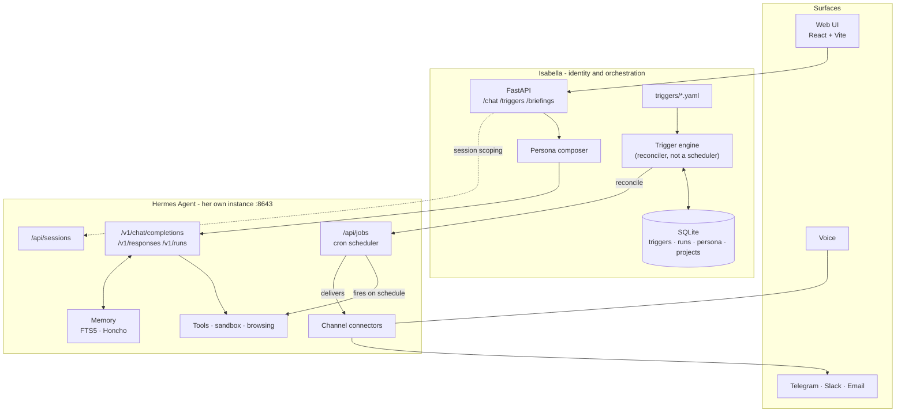

# Architecture

## The boundary

This is the most important thing in the repo. Everything else follows from it.

**Hermes Agent is the substrate. Isabella is the identity on top of it.**

Hermes already ships persistent memory, a cron scheduler, sandboxed tool execution,
model routing, and connectors for Telegram, Discord, Slack, WhatsApp, Signal, Email
and CLI. Isabella does not rebuild any of that.

| Concern | Owner | Notes |
|---|---|---|
| Personality, voice, values | **Isabella** | Versioned persona, composed per request |
| Trigger definitions - *what should happen and why* | **Isabella** | YAML in `triggers/`, source of truth |
| Briefing composition - what belongs in a morning summary | **Isabella** | Domain logic, not a prompt string |
| Web UI | **Isabella** | React, talks only to Isabella's API |
| Project registry - which repos/areas she cares about | **Isabella** | SQLite |
| Run history, audit trail | **Isabella** | SQLite |
| Action policy - who may do what | **Isabella + Hermes** | Two layers; see [PERMISSIONS.md](PERMISSIONS.md) |
| Inference / model routing | **Hermes** | OpenAI, Anthropic, OpenRouter, or local Ollama/vLLM |
| Tool calls, web browsing, vision | **Hermes** | `terminal`, `browser`, `file`, `web` toolsets |
| Sandboxed code execution | **Hermes** | local, Docker, SSH, Modal backends |
| Long-term & conversational memory | **Hermes** | FTS5 session search, Honcho user modeling |
| Scheduling - *when things fire* | **Hermes** | built-in cron, driven via the Jobs API |
| Channel delivery (Telegram, Slack, email, …) | **Hermes** | Isabella is not in these call paths |
| Voice | **Hermes** | `tts` toolset |

**The rule:** Isabella owns *what should happen and why*. Hermes owns *when it fires
and how it executes*.

### The tension, stated plainly

Autonomy is the top priority for this project, and the scheduler lives in Hermes. That
is deliberate, and it has a consequence worth internalising: **Isabella does not have a
heartbeat of her own.** Her trigger engine is a *compiler*, not a runtime. It reads
declarative trigger definitions and reconciles them into Hermes jobs; Hermes' cron then
does the waking up.

The upside is that autonomy works even when Isabella's process is down. The cost is that
Hermes is a hard dependency for anything proactive - if Hermes isn't running, nothing
fires. Accepted knowingly. If that ever becomes intolerable, the escape hatch is to add
an internal scheduler behind the same trigger interface, and the YAML doesn't change.

---

## Components



Note the direction of the trigger arrow: Isabella pushes desired state *into* Hermes.
Hermes fires and delivers on its own. Isabella can be offline when the briefing goes out.

---

## One Hermes each

**`~/.hermes` belongs to Selene.** It is a live install - gateway PID 93753 was running
when this was written, and Selene's `src/core/loop.ts`, `src/core/reason.ts` and
`server/routes.ts` all reference it directly.

Isabella cannot share it. A Hermes install is a single-tenant thing: one `SOUL.md`, one
`config.yaml`, one `state.db`, one set of `platform_toolsets`, one port. Two AIs with
different personalities and different permission ceilings cannot both own those. The
toolset ceilings proposed in [PERMISSIONS.md](PERMISSIONS.md) would silently retune
Selene.

So each gets her own instance:

| | Selene | Isabella |
|---|---|---|
| `HERMES_HOME` | `~/.hermes` | `~/.hermes-isabella` |
| API port | 8642 | 8643 |
| `SOUL.md`, `config.yaml`, toolsets | hers | hers |
| `state.db` - transcripts, memory | hers | hers |
| Gateway process, PID file, service | separate | separate |

`HERMES_HOME` is the supported mechanism - Hermes' own documentation notes it "also
scopes the gateway PID file and systemd service name," so two gateways coexist by design
rather than by luck. Verified on this machine: both gateways run simultaneously, Isabella
on 8643 (PID 66502) and Selene on 8642 (PID 93753).

**`HERMES_HOME` redirects state, not code.** The `hermes` wrapper hardcodes a single shared
program install at `~/.hermes/hermes-agent/`. One binary, two state directories - so a
Hermes upgrade lands for both instances at once, and neither can be pinned independently.

**Cost:** two Ollama-backed gateways on one machine, and model weights loaded twice
unless both point at the same Ollama server. They can - `model.base_url` is
`http://127.0.0.1:11434/v1` in both, so Ollama is shared while everything else is not.
Shared inference, separate minds.

**The rule for anyone working in this repo:** always set `HERMES_HOME` before any
`hermes` command. An unset variable edits Selene.

---

## The Hermes API surface

Verified against the [API server reference](https://hermes-agent.nousresearch.com/docs/user-guide/features/api-server).
Bearer auth (`API_SERVER_KEY`) is required on every endpoint, **including on loopback**.

| Purpose | Endpoints Isabella uses |
|---|---|
| One-shot turn | `POST /v1/chat/completions` |
| Stateful turn | `POST /v1/responses` (`previous_response_id`) |
| Long task w/ progress | `POST /v1/runs`, `GET /v1/runs/{id}/events` (SSE), `POST /v1/runs/{id}/stop` |
| **Scheduled work** | `GET` + `POST /api/jobs`, `PATCH` + `DELETE /api/jobs/{id}`, `POST /api/jobs/{id}/{pause,resume,run}` |
| Sessions | `GET` + `POST /api/sessions`, `GET /api/sessions/{id}/messages`, `POST /api/sessions/{id}/fork` |
| Capability discovery | `GET /v1/capabilities`, `GET /v1/skills`, `GET /v1/toolsets` |
| Health | `GET /health`, `GET /health/detailed` |

**Session headers.** `X-Hermes-Session-Id` scopes a transcript and rotates on `/new`.
`X-Hermes-Session-Key` is the *stable* per-surface identifier that long-term memory
(Honcho) keys off - max 256 chars, no control characters. Isabella must send a
consistent session key per surface, or memory fragments into one scope per session.

**Browser access.** The web UI must not hold the Hermes key. All browser traffic goes
to Isabella's API, which holds the key server-side. `API_SERVER_CORS_ORIGINS` stays
unset; there is no direct browser→Hermes path.

---

## Trigger model

The native automation primitive. Three parts:

```
trigger  →  condition  →  action
```

- **trigger** - `schedule` (cron), `webhook` (external systems call in), `event`
  (something Isabella observes), or `manual`.
- **condition** - optional predicate. Skip silently when false. Keeps "brief me on
  weekdays only" out of the prompt.
- **action** - `prompt` (ask Hermes, with persona applied), `tool` (direct tool call),
  or `notify` (deliver to a channel).

Definitions live in `triggers/*.yaml` and are the source of truth. The engine reconciles
them against `/api/jobs`: create what's missing, `PATCH` what drifted, `DELETE` what was
removed. Reconciliation is idempotent - running it twice changes nothing.

### Worked example - the daily briefing

```yaml
# triggers/daily-briefing.yaml - the real file, not a sketch
id: daily-briefing
enabled: true

trigger:
  type: schedule
  cron: "0 7 * * *"
  timezone: Asia/Manila     # an assertion about her Hermes instance - see below

condition:
  weekdays: [mon, tue, wed, thu, fri]

action:
  type: prompt
  skills: []                # no skills, and no toolsets either
  script: briefing_fetch.py # runs first; its stdout becomes prompt context
  prompt: |
    The script output above is your calendar and unread email. It is the only
    source you have - you have no tools and cannot look anything up.
    Brief me from it:
      1. What's on today, in order, with anything that needs prep called out.
      2. Email that actually needs me - not newsletters, not receipts.
      3. One thing you think I'm forgetting.
    Be direct. If it's a quiet day, say so in one line and stop.

deliver:
  channel: local            # telegram once the connector is configured

guardrails:
  max_runs_per_day: 1
  timeout_seconds: 180
  on_failure: notify   # tell me it broke; never silently skip
```

There is no `persona:` key. Her identity is installed once at
`~/.hermes-isabella/SOUL.md` and applies to every surface including cron; naming it
per-trigger would stack a second identity on top of it.

The schema is strict (`extra="forbid"`): an unknown key is a startup error. A trigger that
acts unprompted is the wrong place to be forgiving about spelling - `max_runs` instead of
`max_runs_per_day` must not quietly mean *no limit*.

**What the reconciler has to absorb**, all verified against Hermes 0.20.4:

| Hermes' behaviour | What the engine does |
|---|---|
| `POST /api/jobs` takes only `name`, `schedule`, `prompt`, `deliver`, `skills`, `repeat` - `model`, `enabled_toolsets` and `workdir` are dropped silently | The client filters to what lands, so a dropped field can't read as an applied one. **A job cannot carry its own toolset restriction over HTTP** - `platform_toolsets` is the only lever |
| `schedule` is sent as a string, returned as `{kind, expr, display}` | Compare against `expr`, or every reconcile PATCHes forever |
| `GET /api/jobs` **hides disabled jobs** unless `include_disabled=true` | Always ask for them. Otherwise a paused job looks missing and gets duplicated - unpaused |
| Cron fields must match `^[\d\*\-,/]+$` before croniter sees them | `condition.weekdays` compiles to `1,2,3,4,5`, never `mon-fri`. Folding it into the cron also means a skipped day never wakes the model |
| Job names are not unique | Reconcile groups by name and deletes duplicates, oldest wins |
| **One timezone per instance** - no per-job timezone | `timezone:` is checked against `HERMES_TIMEZONE` and refuses on mismatch, rather than firing hours off every day |
| `script` and `no_agent` are absent from both POST and PATCH | Reconcile refuses to create a script trigger and returns the `hermes cron create` command; drift is reported, not repaired |
| Unset `platform_toolsets` for a platform means **thirteen** default toolsets, not none | `cron: []` explicitly. The unattended path was the widest surface in the system until this was checked |

### Pre-fetched context - facts without tools

The briefing needs the calendar and the inbox. Those are not native Hermes tools; they come
from a skill that shells out, which needs `code_execution` or `terminal` - both removed by
[PERMISSIONS.md](PERMISSIONS.md) P0, with no Docker on this machine to sandbox them.

So the data is fetched **before** the model runs. `action.script` names a script under
`HERMES_HOME/scripts/`; Hermes runs it each tick and injects its stdout into the prompt as
`## Script Output`. The model composes the briefing from that and has **no tools at all**
(`platform_toolsets.cron: []`).

```
cron tick -> briefing_fetch.py -> stdout injected -> model (zero tools) -> prose -> deliver
```

The distinction that makes this safe: the script is code written and reviewed once, sitting
in a directory Hermes containment-checks. Granting the toolset instead would mean *the model
composing execution at runtime*, unattended, outside `permit()`. Same data, entirely
different blast radius.

Two consequences, neither of them optional:

- **The repo owns the script.** `scripts/` here is the source; Hermes runs the copy in
  `HERMES_HOME/scripts/`. `GET /triggers` compares them and reports `script_install.drifted`,
  because this is exactly the `SOUL.md` failure in a different directory.
- **The script must fail loudly.** A model with no tools and an empty context invents a
  plausible day. Every failure prints an explicit `UNAVAILABLE` line, and the prompt is
  told an invented meeting is worse than an admitted blind spot.
- **The job cannot be created over HTTP.** `POST /api/jobs` takes neither `script` nor
  `no_agent`. Reconcile refuses and returns the `hermes cron create` command to run once;
  after that it manages schedule, prompt, delivery and the kill switch as normal. Script
  drift is reported, never repaired - PATCH cannot fix it either.

`enabled: false` deletes the job; `POST /triggers/{id}/pause` stops it at Hermes and
**outranks the file** until someone resumes it - a kill switch that lasted only until the
next reconcile would not be one. Other edits still reach a paused job: pause freezes
*whether* it runs, not *what* it would do.

### Guardrails are not optional

Anything that can act unprompted must carry a rate limit, a timeout, and a kill switch.
`enabled: false` disables at the source; `POST /api/jobs/{id}/pause` stops it at Hermes.
A trigger whose action creates a condition that fires itself is the failure mode to
design against - that's why `max_runs_per_day` is mandatory, not a default.

---

## Persona system

Her identity is defined in [`Personality/`](Personality/) - fourteen markdown files - and
[BIOGRAPHY.md](BIOGRAPHY.md), her life. [ORIGIN.md](ORIGIN.md) bounds what she may honestly
claim to know about Owen.
Both are read by the persona composer; neither is hardcoded into a prompt string.

Personality is not a static string baked into Hermes. It's composed per request:

```
system prompt  =  core identity          (Personality/ - traits, dials, theme)
               +  life                    (BIOGRAPHY.md - where the traits come from)
               +  honest-knowledge bound (ORIGIN.md - what she may claim about Owen)
               +  situational context    (time, place, what she's mid-way through)
               +  surface adaptation     (terse on Telegram, fuller in the web UI)
```

Kept on Isabella's side for three reasons: it can be versioned and rolled back
independently of Hermes; it can vary per surface and per trigger without touching
Hermes config; and swapping the substrate later doesn't take her identity with it.

Recalled facts come from Hermes' memory via the session key - Isabella does not
assemble a memory context of her own. See below.

---

## Data and state

SQLite at `data/isabella.db`. Isabella stores only what *she* owns:

| Table | Holds |
|---|---|
| `triggers` | Parsed definitions + the Hermes `job_id` they reconcile to |
| `runs` | Execution history: when, outcome, why it failed. Hermes' cron fires without Isabella in the path, so she **pulls** its execution records in rather than being told - keyed on Hermes' execution id, which is what makes the sync idempotent. Her row is an index into Hermes' ledger, never a second copy of it |
| `persona_versions` | Versioned identity, with the ability to roll back |
| `projects` | The repos and areas of life she tracks |
| `decisions` | Every permission verdict - allow, ask and deny alike |

**What is deliberately absent: conversation history and long-term memory.** Those live
in Hermes - in `~/.hermes-isabella/state.db`, her own instance. Measured on Selene's
equivalent install for scale: 62 sessions and 249 messages reach 6.1 MB in three days.
Full inventory, schema and egress analysis in [DATA.md](DATA.md).

The failure mode this avoids: two memory systems drift, and then there is no answer to
"what does she actually know about me?" Every recall path resolves in one place. If
Isabella needs to remember something, it goes to Hermes through the session key - never
into a second store here.

---

## Portability

Isabella must run wherever it's convenient: this MacBook now; a Mac Mini, the old
Windows PC, a Raspberry Pi, or a VPS later. Docker Compose is the deployment unit -
Isabella's API, the web UI, and Hermes as services on one network.

Constraints that follow: no macOS-only assumptions in core code; ARM64 must build
(Pi, Apple silicon); all config through environment variables, never hardcoded paths.

Capabilities degrade by host, and that's expected:

| Host | Loses |
|---|---|
| Non-macOS | iMessage bridge |
| Raspberry Pi | Local inference - must use a hosted provider through Hermes |
| VPS | Access to anything on the home network |

---

## Open decision - how Google authorisation actually happens

The briefing needs a Google token. Getting one is **not** a missing file; it is a flow
nobody has designed yet:

```
Owen picks which Google account and which scopes (Calendar? Gmail? both?)
  -> Google's consent screen, in a browser
  -> redirect back with a code
  -> exchange for a refresh token
  -> store it where briefing_fetch.py can read it
```

The skill ships `scripts/setup.py`, which drives this from a terminal and is enough for one
person once. That is the cheap path and it is probably the right one for M2 - **audience of
one**, and a consent screen he clicks through himself is not worth a redirect handler.

What makes it a real decision rather than a chore:

- **A refresh token is a standing grant.** It reaches the calendar and the mailbox until it
  is revoked, and it will sit on disk next to a process that acts unprompted at 07:00. That
  belongs in [PERMISSIONS.md](PERMISSIONS.md)'s blast-radius thinking, not in a setup step.
- **Scopes are the actual permission boundary.** Read-only Calendar and read-only Gmail are
  a different thing from the send and delete scopes the skill can request. Isabella's policy
  may only ever be *narrower* - so the scopes granted here become her real ceiling for
  Google, above anything `permit()` says.
- **M3 changes the calculus.** Once the web UI exists there is somewhere to put a proper
  "Connect Google" button and a redirect endpoint. Building that now would be M3 work done
  early, which is exactly what the sequencing rule forbids.

**Deferred deliberately, 2026-08-26.** Until it is resolved the briefing runs and reports
the gap honestly - which is the correct behaviour, not a broken state. When it is picked up:
decide the scopes first, then the flow.

## Open decision - remote access

**UNDECIDED.** Deliberately not settled at charter stage. Documented so the tradeoff
doesn't get re-litigated from scratch, and so nothing gets built that forecloses a path.

| Option | For | Against |
|---|---|---|
| **Tailscale** *(recommended)* | Private mesh across all devices; zero ports exposed; works identically on Mac/Windows/Pi/VPS; no TLS or auth to build | Every client device needs Tailscale installed |
| Public HTTPS + token auth | Reachable from anything with a browser | Real attack surface on a service holding calendar, email, and shell access; needs a domain, certs, and hardening |
| Messaging as transport | No inbound network at all; Hermes already polls Telegram | No web UI from outside; constrained to what fits in a chat message |

**Recommendation: Tailscale**, with messaging as the fallback surface - that combination
covers every device without exposing anything. Decide before M5.

Until then: bind to `127.0.0.1`, and treat "how do I reach her from my phone" as
answered by Telegram.

---

## Risks

**Hermes upstream churn.** Isabella depends on an actively-developed project's HTTP API.
*Mitigation:* all Hermes calls go through one typed client in `core/hermes/`. When
upstream changes, exactly one module changes. Pin the Hermes version and upgrade
deliberately.

**Memory duplication.** The most likely way this project rots - a cache here, an
embedding store there, and suddenly her knowledge has two sources. *Mitigation:* the
prime directive in `CLAUDE.md`, and the absence of any memory table in the schema above.

**Runaway autonomy.** A trigger that loops, spams, or acts on stale context. Real risk
once she has tool access to email and a shell. *Mitigation:* mandatory guardrails per
trigger; every run written to `runs` before delivery; `on_failure: notify` rather than
silent retry; `HERMES_MAX_ITERATIONS` capped well below its default of 500; and the
action policy in [PERMISSIONS.md](PERMISSIONS.md), whose `trigger` subject is the
strictest of all because unattended is her normal state.

**Policy that isn't a boundary.** Isabella is one Hermes client among several - Telegram,
cron and the CLI all reach the same tools without her in the call path. A gate enforced
only in Isabella would be theatre. *Mitigation:* the two-layer model in
[PERMISSIONS.md](PERMISSIONS.md) - Hermes' own `platform_toolsets` and env floor are the
real ceiling, and Isabella's policy may only ever be narrower, never wider.

**Secrets across hosts.** The Hermes key, channel tokens, and provider keys must move
between machines without landing in git. *Mitigation:* `.env` gitignored, never
committed; document what each host needs rather than syncing files around.

**Scope creep.** Four ambitions were named at charter time - life ops, second brain, dev
copilot, proactive daemon. Building all four at once produces none. *Mitigation:*
`ROADMAP.md`, and the rule that each milestone must be usable before the next starts.
