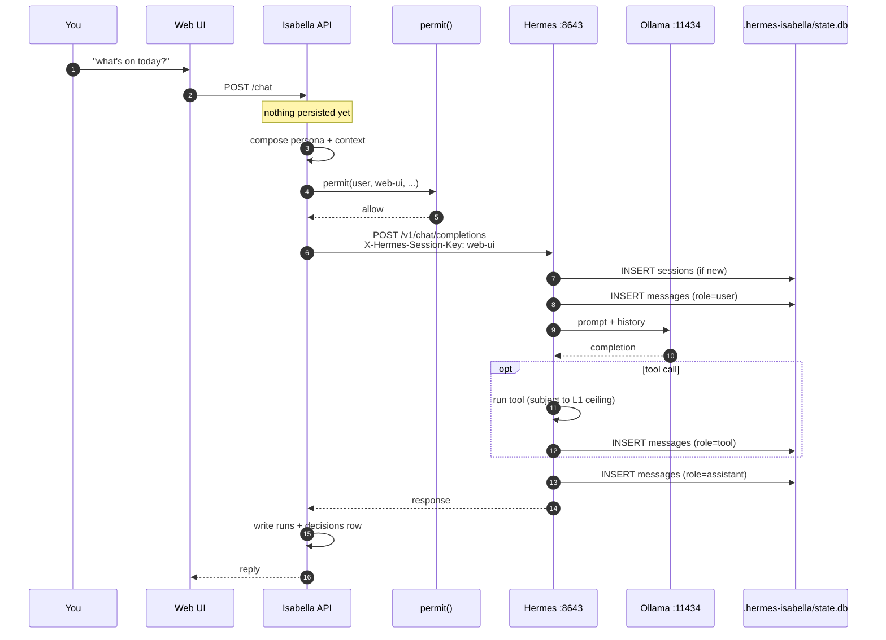
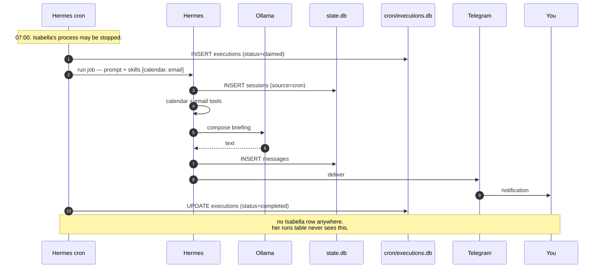
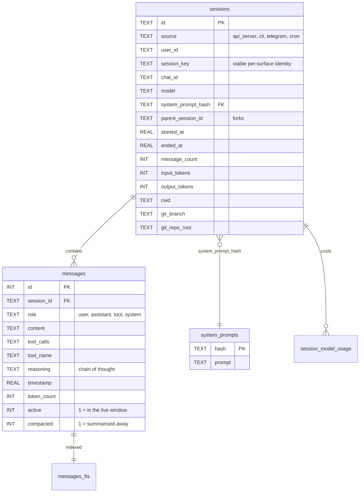
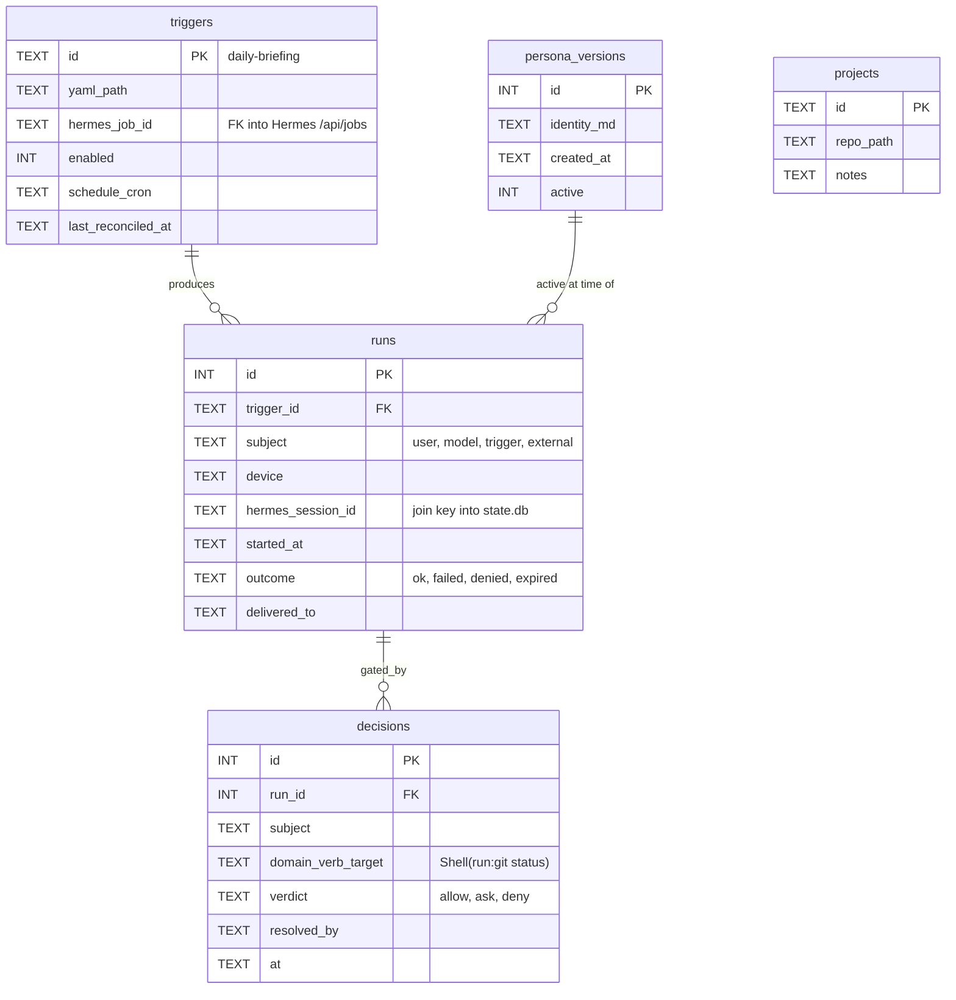

# Isabella Data Flow

**Date:** 2026-08-23
**Status:** Design — schema and behaviour verified against the live Hermes install on this Mac
**Companions:** [[README]] · [[ARCHITECTURE]] · [[PERMISSIONS]] · [[ROADMAP]] · [[CLAUDE]]

Where a message goes, what gets written down, where it lives, and what leaves the machine.

Everything in the "Where it lives" and "What leaves" sections was read from a real
Hermes install on 2026-08-23, not inferred from documentation.

**Whose install, precisely.** The numbers below come from `~/.hermes` — which belongs to
**Selene**, not Isabella ([[ARCHITECTURE]] §One Hermes each). Isabella has her own
instance at `~/.hermes-isabella` on port 8643, and it is empty until M1. Selene's install
is used here as a *preview*: same Hermes version, same schema, same defaults, and a
truthful picture of what Isabella's will look like once she starts talking. Where a path
below reads `~/.hermes`, Isabella's equivalent is `~/.hermes-isabella`.

---

## The finding that reframes this document

**Isabella stores almost none of your data. Hermes stores nearly all of it.**

Selene's `~/.hermes/state.db` holds **62 sessions and 249 messages, 6.1 MB** after three
days — and every one of those sessions has `source = 'api_server'`, meaning they arrived
over exactly the kind of connection Isabella will make. That is the shape of what
`~/.hermes-isabella/state.db` becomes.

So "where is my data?" is answered by `~/.hermes-isabella/`, not by this repo.
Isabella's own database holds triggers, run history, persona versions and verdicts —
**no message content at all.** That is a deliberate consequence of [[ARCHITECTURE]]
§Data and state: two memory systems drift, and then nothing can answer what she actually
knows.

The practical consequence, and it is the one that matters:

> **Backing up this repo backs up almost nothing. Backing up `~/.hermes-isabella` backs
> up your conversations with her, her profile of you, and everything she has learned.**

And the mirror of that: backing up `~/.hermes` backs up *Selene*. Two directories, two
minds, two backup jobs.

---

## The second finding: today, nothing leaves this machine

Read from Selene's `~/.hermes/config.yaml`. Isabella's instance starts from Hermes'
defaults, so **this is the configuration to replicate, not inherit** — a fresh
`HERMES_HOME` does not copy it:

```yaml
model:
  default: qwen3:4b-16k
  provider: custom
  base_url: http://127.0.0.1:11434/v1    # Ollama. Local.
```

Inference runs on this Mac. And of the hosted memory and telemetry providers Hermes
supports — Honcho, Hindsight, Mem0, RetainDB, Supermemory, Langfuse — **none are
configured.** That `.env` has 15 active keys and not one of them is a third-party
credential.

**This property is not inherited.** `~/.hermes-isabella` is a new directory with stock
defaults; local-only is something to set up deliberately there, not something Isabella
gets for free by being on the same machine.

That is a stronger privacy position than [[ARCHITECTURE]] assumed. It is also **one
environment variable away from changing**, silently, with no prompt. See §What would
break it.

---

## How a message passes through

Two paths, and they differ in the way that matters most: whether you are there.

### Attended — you type something



**What Isabella writes: one `runs` row and one `decisions` row.** Not the message. Not
the reply. The transcript is Hermes' at step 7 and stays Hermes'.

### Unattended — the daily briefing

This is the path that actually characterises her, because it is the one that runs while
you are asleep. **Isabella is not in it.**



**This is the data gap.** The briefing is the flagship feature and Isabella has no record
that it happened. Her `runs` table describes only what passed through her. Reconciling
that means polling `GET /api/jobs/{id}` for last-run state and writing it back — real
work, listed in §Open questions, not quietly assumed.

It is the same shape as the enforcement gap in [[PERMISSIONS]]: **anything that does not
pass through Isabella is invisible to Isabella.** Policy and audit fail at the same seam,
for the same reason.

---

## Where it lives

**These are Isabella's paths.** Sizes are measured from Selene's equivalent install on
2026-08-23 — same Hermes version, same layout — and are shown to give a sense of scale,
not because Isabella's directory holds them yet. Hers is empty until M1.

| Path | Holds | Backup? | Size on Selene's |
|---|---|---|---|
| `~/.hermes-isabella/state.db` | Sessions, messages, FTS index, system prompts | **Critical** | 6.1 M |
| `~/.hermes-isabella/skills/` | Skill packs — stock at first, self-taught later | **Critical once learned** | 5.9 M |
| `~/.hermes-isabella/config.yaml` | Model, toolsets, memory, compression | Yes | 4.8 K |
| `~/.hermes-isabella/.env` | **Secrets.** API keys, tokens | Yes — encrypted, never git | 24 K |
| `~/.hermes-isabella/cron/executions.db` | Scheduled-run history — the briefing | Yes | 60 K |
| `~/.hermes-isabella/kanban.db` | Multi-agent task board | Optional | 116 K |
| `~/.hermes-isabella/response_store.db` | `/v1/responses` state | Optional | 20 K |
| `~/.hermes-isabella/logs/` | Agent logs | No — rotate | 456 K |
| `~/.hermes-isabella/cache/` | Model catalogues, derived | No | 416 K |
| `~/.hermes-isabella/sandboxes/` | Shell workspaces | No | 0 B |
| `Isabella/policy/permissions.json` | The action policy | **Git** | — |
| `Isabella/triggers/*.yaml` | Trigger definitions | **Git** | — |
| `Isabella/data/isabella.db` | Triggers, runs, persona, projects, decisions | Yes | — |

**Not Isabella's, and never to be touched:** `~/.hermes/` — Selene's install, live on a
separate gateway. It appears nowhere in Isabella's backup or config story.

Two notes on that table.

**`skills/` is the only store with no upstream copy.** On Selene's install all 14 are
stock category bundles (`apple`, `devops`, `github`, `email`, …) shipped with Hermes, so
nothing there is irreplaceable *yet*. The moment Hermes' learning loop starts writing
skills of its own, that directory becomes the least replaceable thing Isabella owns.

**A stock `.env` is ~24 KB but only ~15 keys are active** — the rest is commented
documentation. Convenient, and a trap: an egress-enabling variable is one deleted `#`
away from being live. See §What would break it.

---

## Schematic — Hermes' tables

Read from a live `state.db`. This is the real schema, not a sketch — and it is identical
for both instances, because it comes from the same Hermes version.



Three columns deserve attention:

- **`reasoning`** — chain-of-thought is persisted alongside the reply. Her private
  thinking is on disk, not just her output.
- **`cwd`, `git_branch`, `git_repo_root`** — sessions record which repo you were in.
  Useful for the dev-copilot ambition; also a record of what you were working on and when.
- **`active` / `compacted`** — see below.

### Your history is a compacting store, not an archive

`config.yaml` has `compression.enabled: true`, `threshold: 0.5`, `target_ratio: 0.2`,
`protect_last_n: 20`. When a session's context fills, older turns are summarised and the
originals flagged.

I verified the columns exist and that compression is on. **I did not verify whether
compacted rows are eventually deleted or retained indefinitely** — that needs reading the
compaction code, and I would rather say so than guess about your data.

Either way the honest framing is: **do not treat `messages` as a permanent verbatim
record of everything ever said.** If you want that, snapshot the DB.

---

## Schematic — Isabella's tables

Proposed. None of this exists yet.



**`runs.hermes_session_id` is the join.** It is the only thread stitching Isabella's audit
trail to Hermes' transcripts. Without it, "why did she do that at 07:00?" has no answer —
her side records the decision, Hermes' side records the words, and nothing connects them.
Store it on every run or the audit trail is decorative.

---

## What leaves the machine

Ranked by how much it would matter.

| Sink | Sends | Status today |
|---|---|---|
| **Inference provider** | Every prompt, full history, system prompt | **Local** — Ollama on `127.0.0.1:11434` |
| **Honcho** | Behavioural model of you, cross-session | **Off** — defaults to Honcho *cloud* if enabled |
| **Hindsight / Mem0 / RetainDB / Supermemory** | Memory contents | **Off** — all default to hosted |
| **Langfuse** | Full traces: prompts and responses, 12 000 chars/field | **Off** — defaults to `cloud.langfuse.com` |
| **Channel connectors** | Every delivered message | Telegram, when M2 lands — their servers, their retention |
| **`web_search` / `web_extract`** | Your query text | Per call, to whichever search backend |
| **`image_gen`** | Your prompt | FAL.ai, when used |
| **BrowserBase** | Browsing session | Keys present in `.env` — verify before enabling |

### What would break it

Setting any one of these turns a local-only system into one that ships your data out.
None of them warns you:

```sh
HONCHO_API_KEY=...          # your psychological profile → Honcho cloud
HERMES_LANGFUSE_PUBLIC_KEY= # every prompt and reply → cloud.langfuse.com
MEM0_API_KEY=...            # memories → app.mem0.ai
HINDSIGHT_API_KEY=...       # memories → hindsight.vectorize.io
SUPERMEMORY_API_KEY=...     # memories → supermemory.ai
model.provider: anthropic   # config.yaml — every prompt leaves, no env var involved
HERMES_DUMP_REQUESTS=true   # full payloads written to log files in plaintext
```

`HONCHO_BASE_URL` and `MEM0_HOST` point at self-hosted instances if you ever want those
capabilities without the egress. That is the middle path, and it is documented.

**The last two are the sneaky ones.** Changing the model provider in `config.yaml`
involves no environment variable at all — the local-inference property is a *config
value*, not a guarantee. And `HERMES_DUMP_REQUESTS` writes plaintext prompts to disk in
a directory that is not otherwise sensitive.

---

## Retention

| Data | Lifetime | Controlled by |
|---|---|---|
| Messages | Indefinite, but compacted in place | `compression.*` in `config.yaml` |
| Sessions | Reset after idle; currently `mode: none` | `session_reset.*` |
| Cron executions | Indefinite | Nothing — grows unbounded |
| Isabella `runs` / `decisions` | Indefinite | Nothing yet — **needs a policy** |
| Pending approvals | 240 minutes, then dropped as stale | [[PERMISSIONS]] §queue |
| Logs | Indefinite | Nothing — rotate them |
| Sandboxes | 300 s lifetime | `terminal.lifetime_seconds` |

Three of those say "nothing." An audit log that grows forever eventually becomes the
largest thing you own and the least read. Worth deciding before P2 of [[PERMISSIONS]]
turns on decision logging for every call.

---

## Reading your own data

No tooling required.

```sh
# every session, newest first
sqlite3 ~/.hermes-isabella/state.db \
  "select datetime(started_at,'unixepoch'), source, message_count, model
   from sessions order by started_at desc limit 20;"

# a conversation, in order
sqlite3 ~/.hermes-isabella/state.db \
  "select role, substr(content,1,120) from messages
   where session_id='<id>' order by timestamp;"

# full-text search everything she has ever been told
sqlite3 ~/.hermes-isabella/state.db \
  "select session_id, substr(content,1,160) from messages_fts
   where messages_fts match 'briefing' limit 20;"

# what has she cost
sqlite3 ~/.hermes-isabella/state.db \
  "select sum(input_tokens), sum(output_tokens) from sessions;"

# snapshot before doing anything destructive
sqlite3 ~/.hermes-isabella/state.db ".backup ~/isabella-backup-$(date +%F).db"
```

`.backup` is the correct way to copy a live SQLite database. `cp` on a WAL-mode DB —
which this is, `journal_mode: wal` — can capture a torn state.

---

## Portability

[[ARCHITECTURE]] §Portability says she should run on the Mac Mini, the Windows box, a Pi,
or a VPS. **The data question that raises has no answer yet.**

Moving hosts means moving `~/.hermes-isabella/` entire, or she arrives with amnesia. Running on two hosts at once means either one is authoritative and the other
is a client, or they fork and never reconcile — SQLite gives you no merge.

The likely shape: **one host owns `~/.hermes-isabella`; every other device is a remote
client over Tailscale.** That is not a second Isabella, it is a second window onto the same one — and
it makes the deferred remote-access decision a *data* decision, not just a network one.

---

## Open questions

1. **Cron runs are invisible to Isabella.** The briefing produces no `runs` row. Poll
   `GET /api/jobs/{id}` for last-run state and reconcile? Or accept that her audit trail
   covers only attended work and say so plainly in the UI?

2. **Are compacted messages deleted?** Not verified. Determines whether `state.db` is an
   archive or a rolling window — and therefore what a backup is actually worth.

3. **Retention for `decisions`.** [[PERMISSIONS]] logs every verdict including allows.
   At what age does that get pruned, and does pruning an audit log defeat its purpose?

4. **`reasoning` is on disk.** Her chain-of-thought is persisted per message. Is that
   wanted — useful for debugging why she did something — or is it the most sensitive
   column in the schema? It is currently both.

5. **Sessions record `git_repo_root` and `cwd`.** A log of what you worked on and when,
   accumulating as a side effect. Fine, probably. Worth knowing it exists.

6. **`terminal.backend: local`, not `docker`.** [[PERMISSIONS]] P0 recommends
   `TERMINAL_ENV=docker` so shell runs contained. The live config runs on the host. This
   is a real gap between the recommendation and the machine — close it before M2.

7. **Nothing is encrypted at rest.** `state.db` is a plain file containing every
   conversation. FileVault covers it on this Mac; a Pi or VPS would not, by default.

8. **Two gateways, one Ollama.** Both instances can point `model.base_url` at
   `http://127.0.0.1:11434/v1` so weights load once. Unverified: whether concurrent
   requests from both gateways to one Ollama contend badly on a 4 B model. Worth
   measuring before M2, since the briefing fires unattended and must not be starved by
   whatever Selene is doing.
