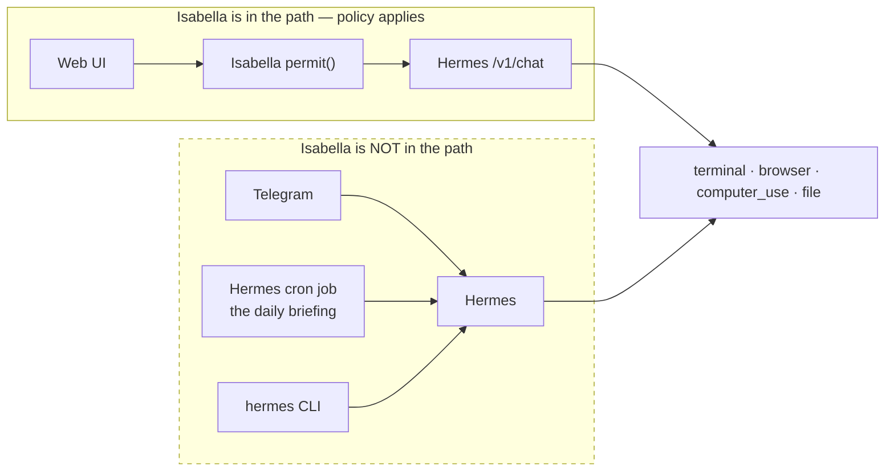
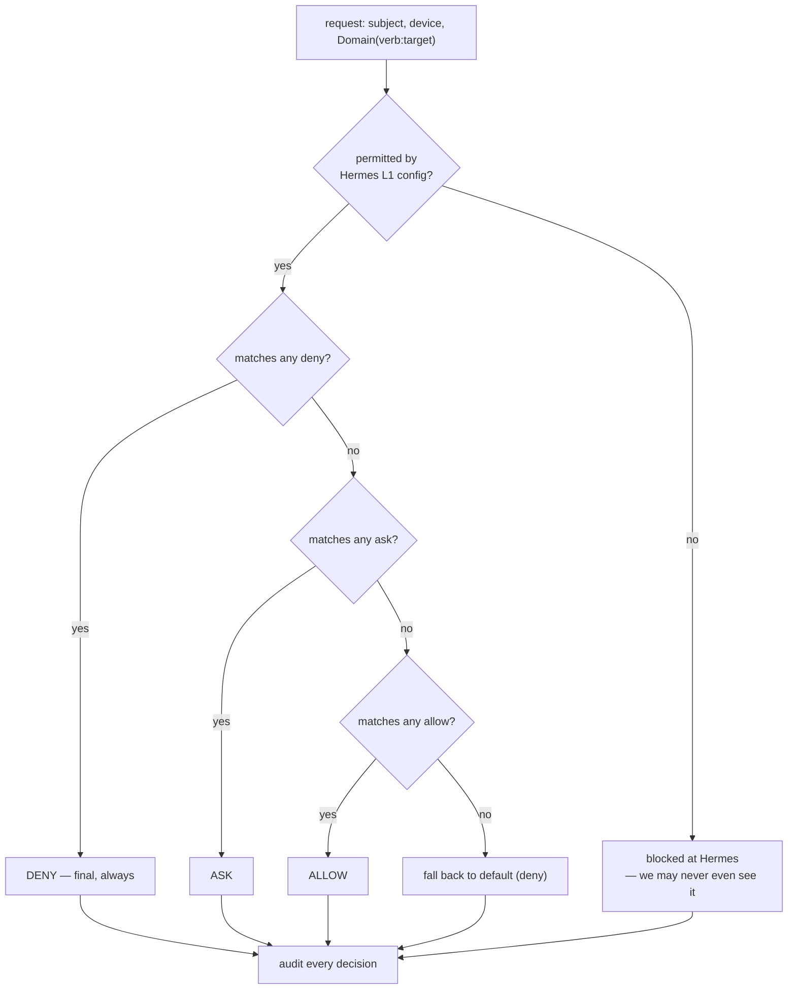
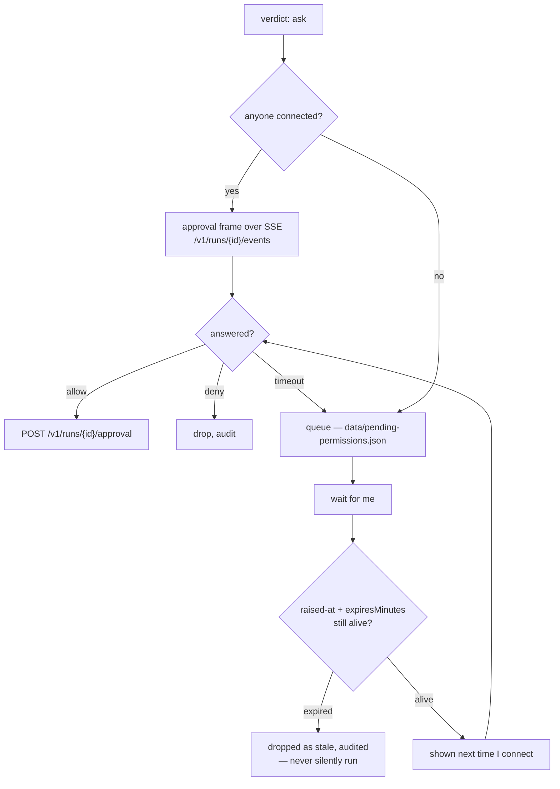

# Isabella Permissions

**Date:** 2026-08-23
**Status:** Design — no code written
**Companions:** [[README]] · [[ARCHITECTURE]] · [[ROADMAP]] · [[CLAUDE]] · [[Selene-Permissions]]

A declarative JSON policy Isabella consults **before taking an action** — `allow`, `deny`,
`ask` — in the shape of `Domain(verb:pattern)`.

She should be able to run shell commands, drive the Mac, open a browser, play media, and
fetch APIs. This document is how she gets to do those things *without* it being reckless.

---

## The finding that reframes this feature

**Selene's policy was a precondition. Isabella's is a retrofit — and a partial one.**

[[Selene-Permissions]] opens on the observation that Selene's model *cannot take any action
today*: every side effect originates from grammar over his own words, so the gate could be
built before there was anything to gate. That is the only order in which a gate is ever
trustworthy.

**Isabella has the opposite problem.** Her substrate arrives with full agency on day one.
Verified against Hermes' [toolsets reference](https://hermes-agent.nousresearch.com/docs/reference/toolsets-reference):

| Toolset | Tools | What it means |
|---|---|---|
| `terminal` | `terminal`, `process` | Arbitrary shell execution and background processes |
| `code_execution` | `execute_code` | Arbitrary Python |
| `file` | `read_file`, `write_file`, `patch`, `search_files` | Read and rewrite the filesystem |
| `browser` | 13 tools incl. `browser_cdp`, `browser_navigate`, `browser_click` | Full browser control |
| `computer_use` | `computer_use` | Background desktop control via cua-driver |
| `homeassistant` | `ha_call_service`, … | Physical actuators in the house |
| `delegation` | `delegate_task` | Spawn subagents — which inherit capability |

There is no phase of this project where Isabella is safely inert. **The gate is being built
after the capability exists**, which means the sequencing question is not "when do we grant
agency" but "how much do we take away, and how fast."

### The harder finding: a policy only Isabella consults is not a boundary

Selene's document flags the Hermes gateway's invisible server-side tools as *"the one
exception, stated honestly."* In Isabella that exception is not an exception.

**It is the entire system.**

Isabella is one client of Hermes among several. Hermes owns the Telegram connector, the CLI,
and the cron scheduler that fires the daily briefing. Every one of those reaches the tools
above **without Isabella in the call path at all**:



The M2 daily briefing — the first thing Isabella does, the milestone that justifies the
project — runs as a **Hermes cron job**. Isabella's process may not even be running when it
fires. That was a deliberate architectural win ([[ARCHITECTURE]] §The tension); it is also
the exact reason a policy enforced only in `permit()` would be theatre.

**So enforcement has to live in two layers, and the outer one is not ours.**

---

## Two layers, one source of truth

| | Layer | Enforces | Bypassable by |
|---|---|---|---|
| **L1** | Hermes config + env | The hard ceiling. Applies to *every* surface — Telegram, cron, CLI, API | Nothing short of editing Hermes' config |
| **L2** | Isabella `permit()` | Subject, device, time-of-day, per-trigger nuance. Auditable, expressive | Any Hermes surface Isabella isn't on |

**The invariant, and the single most important line in this document:**

> **L2 may only ever be narrower than L1. Never wider.**
> If the policy grants something Hermes' config forbids, the policy is *wrong* — not Hermes.

The way to guarantee that rather than hope for it: **generate L1 from the policy file.**
`policy/permissions.json` is the source; a build step renders
`~/.hermes-isabella/config.yaml`'s `platform_toolsets` and the env floor from it. One file, two enforcement points, no drift.

This is the same move [[Selene-Permissions]] makes when it derives `capabilityLines()` from
the policy so *"never claim a capability you don't have"* stops being a rule the model must
remember and becomes a fact about the text it was given. Same principle, one level lower:
**prose becomes enforcement; policy becomes configuration.**

### L1 — the floor, verified

From Hermes' [environment variables reference](https://hermes-agent.nousresearch.com/docs/reference/environment-variables):

These go in **`~/.hermes-isabella/.env`** — Isabella's own instance. Writing them to
`~/.hermes` would retune Selene instead ([[ARCHITECTURE]] §One Hermes each).

```sh
# ~/.hermes-isabella/.env — the hard ceiling. Isabella cannot widen these.
HERMES_EXEC_ASK=true              # approval prompts in gateway mode. NEVER false.
HERMES_WRITE_SAFE_ROOT=/Users/owen/Projects:/Users/owen/.hermes-isabella
                                  # writes outside these fail immediately.
                                  # rejections bypass the approval system entirely —
                                  # this is the one control that cannot be talked past.
TERMINAL_ENV=docker               # shell runs in a container, not on the host
HERMES_MAX_ITERATIONS=60          # default 500. a runaway loop is the autonomy risk.
HERMES_ALLOW_PRIVATE_URLS=false   # no reaching into the home network from a prompt

# Never set. Listed so their absence is deliberate rather than accidental:
# HERMES_YOLO_MODE=1              # skips dangerous-command approval
# SUDO_PASSWORD=...               # sudo with no prompt
# HERMES_ACCEPT_HOOKS=1           # auto-approves unseen shell hooks
```

```yaml
# ~/.hermes-isabella/config.yaml — per-platform ceilings.
# Generated from policy/permissions.json.
platform_toolsets:
  api_server:  [file, web, search, memory, session_search, browser, vision, tts, clarify]
  telegram:    [web, search, memory, session_search, clarify]   # no shell from the phone
  cli:         [coding]                                         # the one place I'm present

agent:
  disabled_toolsets: [computer_use, video_gen]
  # applied AFTER per-platform config — an unconditional deny, the same shape
  # as "deny always wins" below. This is the global kill switch.
```

Note what `api_server` — Isabella's own channel — deliberately lacks: `terminal`,
`code_execution`, `delegation`, `homeassistant`, `cronjob`. Shell exists in the `cli`
toolset, where I am physically present and Hermes prompts me directly. **Isabella gets shell
by asking me in a terminal, not by having it.**

---

## Syntax — `Domain(verb:pattern)`

Mapped onto Hermes' real toolsets rather than invented ones, so every rule traces to
something that actually exists.

| Domain | Examples | Hermes toolset |
|---|---|---|
| `Shell` | `Shell(run:git status)` · `Shell(run:*)` · `Shell(process:*)` | `terminal` |
| `Code` | `Code(python:*)` | `code_execution` |
| `File` | `File(read:**)` · `File(write:Projects/**)` · `File(patch:*)` | `file` |
| `Browse` | `Browse(navigate:github.com)` · `Browse(click:*)` · `Browse(cdp:*)` | `browser` |
| `Net` | `Net(search:*)` · `Net(fetch:api.open-meteo.com)` | `web`, `search` |
| `Desktop` | `Desktop(control:*)` · `Desktop(open:*)` | `computer_use`, `desktop_ui` |
| `Media` | `Media(image:*)` · `Media(video:*)` · `Media(speak:*)` · `Media(analyse:*)` | `image_gen`, `video_gen`, `tts`, `vision` |
| `Music` | `Music(play:*)` · `Music(search:*)` | `spotify` |
| `Home` | `Home(read:*)` · `Home(call:light.*)` | `homeassistant` |
| `Memory` | `Memory(write:*)` · `Memory(search:*)` | `memory`, `session_search` |
| `Schedule` | `Schedule(create:*)` · `Schedule(delete:*)` | `cronjob`, Isabella's `/api/jobs` client |
| `Delegate` | `Delegate(spawn:*)` | `delegation` |
| `Policy` | `Policy(write:*)` | this file — see Open Question 3 |

**Pattern rules** — carried over unchanged from [[Selene-Permissions]], because divergence
between two policy files in the same house is its own bug:

- `*` matches within one segment; `**` matches across separators.
- `Domain(*)` means every verb of that domain.
- Case-insensitive on domain and verb; case-sensitive on the pattern.

---

## Structure

```jsonc
// policy/permissions.json
{
  "version": 1,
  "default": "deny",

  "subjects": {
    "user": {
      // Me, present and typing. I am the one being protected, not constrained.
      "allow": ["**"],
      "ask":   ["File(delete:**)", "Policy(write:*)"]
      // one keystroke, and it makes a mistyped instruction survivable
    },

    "model": {
      // Isabella reasoning while I am present to see it happen.
      "allow": [
        "File(read:**)", "Net(search:*)", "Net(fetch:*)",
        "Memory(write:*)", "Memory(search:*)",
        "Media(analyse:*)", "Media(speak:*)",
        "Browse(navigate:*)", "Browse(snapshot:*)"
      ],
      "ask": [
        "Shell(run:*)", "Code(python:*)",
        "File(write:Projects/**)", "File(patch:**)",
        "Desktop(open:*)", "Music(play:*)", "Home(call:*)",
        "Browse(click:*)", "Browse(type:*)", "Media(image:*)"
      ],
      "deny": [
        "File(write:**)",        // narrowed by the Projects/** ask above? No —
                                 // deny wins. Widen by narrowing THIS line, visibly.
        "File(delete:**)", "Browse(cdp:*)", "Desktop(control:*)",
        "Delegate(spawn:*)", "Schedule(delete:*)", "Policy(write:*)"
      ]
    },

    "trigger": {
      // Automations firing unattended. The daily briefing lives here.
      // Nobody is watching. This is the subject that matters most.
      "allow": [
        "File(read:**)", "Net(search:*)", "Memory(search:*)",
        "Memory(write:*)", "Media(analyse:*)"
      ],
      "ask":   ["Net(fetch:*)"],
      "deny":  [
        "Shell(*)", "Code(*)", "File(write:**)", "File(delete:**)",
        "Desktop(*)", "Browse(click:*)", "Browse(type:*)", "Browse(cdp:*)",
        "Home(call:*)", "Delegate(*)", "Schedule(*)", "Policy(*)"
      ]
    },

    "external": {
      // Webhook callers at M4 — n8n, GitHub Actions, Home Assistant.
      // Authenticated, but not trusted: a token in someone else's system.
      "allow": ["Memory(write:*)"],
      "ask":   ["Net(search:*)"],
      "deny":  ["**"]
      // Deliberately near-total. External systems request that Isabella
      // *think*; they do not get to make her *act*.
    }
  },

  "devices": {
    "web-ui":   { "inherit": "user" },
    "telegram": { "inherit": "model", "deny": ["Shell(*)", "Code(*)", "File(write:**)", "Desktop(*)"] },
    "cli":      { "inherit": "user" },
    "unknown":  { "allow": ["File(read:Projects/**)"], "default": "deny" }
  },

  "unattended": { "ask": "queue" },
  "queue":      { "expiresMinutes": 240, "max": 20 },

  "audit": { "decisions": "all" }
}
```

### Precedence: `deny` always wins



**Why deny is absolute, and not most-specific-match.** As the file grows, a narrow `allow`
added months later silently punches a hole through a broad `deny` written for a reason, and
nothing tells you. An unconditional deny is the only rule that stays legible at 200 lines.
To make an exception, narrow the deny — visibly, in a diff.

The `model` block above shows this working: `File(write:Projects/**)` sits in `ask` while
`File(write:**)` sits in `deny`, so **the write is denied.** That is not a bug in the
example; it is the rule doing its job, and the comment says so. Granting it means editing
the deny line where the change is reviewable.

---

## `permit()` — one choke point

`core/policy/permit.py`:

```python
Verdict = Literal["allow", "ask", "deny"]

def permit(subject: Subject, device: str, domain: str,
           verb: str, target: str, ctx: Ctx) -> Verdict: ...
```

1. **Called at every site that reaches Hermes with tools enabled — never reimplemented
   locally.** A second copy of the logic is a second thing to get wrong.

2. **Every decision is audited, including allows.** A policy you cannot review after the
   fact is a policy you cannot tune. The `runs` table already exists ([[ARCHITECTURE]]
   §Data and state); decisions join it.

3. **Fails closed.** Missing, unparseable, or wrong-version policy denies everything except
   a hardcoded read-only floor. The failure mode of a permission system must never be
   "permissive."

4. **Pure and synchronous.** Policy loaded once, re-read on mtime change. A permission check
   must never be the thing that makes a turn slow.

5. **Denials are visible to her.** She learns she was refused, so she can say so, rather
   than the call failing invisibly and her inventing a reason. Honest refusal beats silent
   failure — and it is how I find out the policy is wrong.

### Where it lives

`policy/permissions.json`, in the repo. Not `data/` — that is SQLite, gitignored, and
explicitly disposable. **A policy that vanishes with the cache is a policy that fails open
exactly when you least want it to.** In the repo it is versioned, diffable, and every change
is a commit with an author and a date.

---

## The approval queue

`ask` needs an answerer. When the briefing fires at 07:00 and I am asleep, there is nobody.

**Chosen behaviour: queue it and wait.**



**Hermes already has the transport.** `POST /v1/runs/{run_id}/approval` exists to *"resolve
pending approval for human-gated decisions,"* and `GET /v1/runs/{run_id}/events` is the SSE
channel it arrives on. This is not a mechanism Isabella needs to invent — it is one she
needs to *drive*, which is a considerably smaller job.

**Why it expires.** An approval that waits indefinitely eventually executes a 07:00 decision
at 15:00, in a context that no longer exists. Expiry is what makes queue-and-wait safe
rather than merely deferred. 240 minutes — same default as [[Selene-Permissions]], same
reasoning: four hours is "later today," not "whenever."

**Durability.** This queue persists to disk. Its entire purpose is surviving hours of
absence; one that vanishes on restart has failed at the only thing it does.

### The unattended default is the real policy

Most of what Isabella does, she will do while I am not there. So the `trigger` subject's
rules are not a footnote to the `model` rules — **they are the ones that describe how she
actually behaves.** Read that block first when tuning.

---

## Phasing

| Phase | Work | Risk |
|---|---|---|
| **P0** | **L1 first.** Set the env floor and `platform_toolsets` by hand. `TERMINAL_ENV=docker`, `HERMES_MAX_ITERATIONS=60`, `HERMES_WRITE_SAFE_ROOT`. | None — and it is the only layer that covers cron and Telegram |
| **P1** | `permit()`, the schema, the loader, audit on every decision. **Nothing calls it.** | None — pure addition |
| **P2** | Wire read-only: `File(read)`, `Net(*)`, `Memory(*)`. Run a week. Read the audit log. Tune against what she actually does, not what I imagined. | None — reads were already happening |
| **P3** | Generate `config.yaml` + env floor **from** `permissions.json`. One source, no drift. | Low |
| **P4** | Wire writes and acts: `File(write)`, `Shell`, `Browse(click)`, `Desktop`, `Media`, `Music`. First real refusals. | Medium |
| **P5** | Queue, expiry, and driving `/v1/runs/{id}/approval`. | Medium |
| **P6** | Per-device rules — needs a device registry. | Depends |

**P0 lands before M2.** The briefing is the first unattended thing she does, and it must not
be the thing that discovers the floor is missing. P2's week of observation is the important
one: it tells you what she actually does before you start forbidding things.

---

## Open questions

1. **Cron jobs carry their own capability.** A Hermes job created via `POST /api/jobs`
   accepts a `skills` list. Isabella writes that list — so `Schedule(create:*)` is
   effectively *capability granting*, and a subject that can create jobs can grant itself
   anything the platform ceiling allows. `trigger` denies `Schedule(*)` for this reason, but
   `user` does not. Is that right? Probably it wants `ask`.

2. **Does `user` really get `**`?** I am the one being protected — but a mistyped "delete
   everything in Projects" is still a mistyped instruction. The draft already puts
   `File(delete:**)` behind `ask` for me. That may not go far enough.

3. **The policy file is itself writable.** `File(write:policy/permissions.json)` must be
   denied to every subject except `user` — otherwise the gate can rewrite itself. `Policy`
   exists as a domain for exactly this. This is the same failure Selene's `act.ts:29-34`
   guards against: *"a reasoner that could widen its own reach by saying the words would be
   the whole gate, gone."*

4. **Subagents inherit capability.** `Delegate(spawn:*)` is denied everywhere in the draft
   because a subagent's permissions are an unanswered question. Does a delegated task run as
   `model`, or as its own subject with its own floor? Until that has an answer, denied.

5. **Telegram is Hermes' surface, not Isabella's.** The `devices.telegram` block is
   *aspirational* — Isabella is not in that call path, so today it is enforced solely by
   `platform_toolsets.telegram` at L1. Either accept that Telegram is L1-only, or route the
   connector through Isabella and lose the "works when Isabella is down" property. A real
   tradeoff, not an oversight.

6. **How is a device recognised?** A cookie is per-browser, not per-device, and clearing it
   makes a trusted phone `unknown`. Blocks P6.

7. **Selene shares this machine.** Isabella's L1 ceiling protects Isabella's instance.
   It does nothing about Selene, who has her own toolsets and her own shell access to the
   same filesystem. Two AIs on one Mac is a threat model neither document has addressed.

8. **`HERMES_WRITE_SAFE_ROOT` is host-specific.** `/Users/owen/...` is wrong on the Pi, the
   Windows box, and the VPS. Per-host env, generated per host — ties to [[ARCHITECTURE]]
   §Portability.
